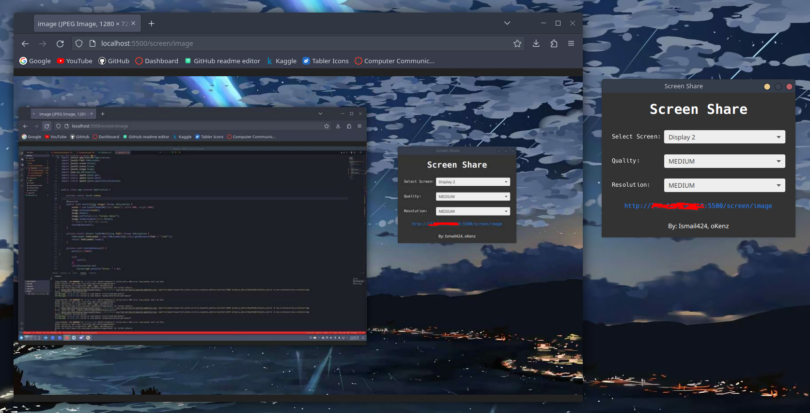

# Screen Share 
This is a simple screen sharing application that captures a screenshot the screen and serves it with a simple HTTP local server.

## How to use
1. Clone the repository
2. Run the application
3. Copy the link inside the applicationand paste it in your browser.
4. You can also use the link in your browser (http://localhost:5500/screen/image)
5. Done!

## Routes
- `/screen/image/base64` - Returns the image of the screen in base64
- `/screen/image` - Returns the image of the screen
- `/screen` - Returns pixel data of the screen

## Author
- [Ismail424](https://github.com/ismail424)
- [oKenzz](https://github.com/oKenzz)
